# Commands and Screenshots for Assignment

##### Created the altschool user with ```sudo adduser -m altschool```
   
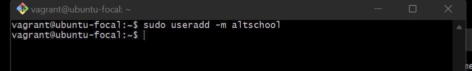

#### After switching to the altschool, created the sub directories with ```mkdir code tests personal misc```

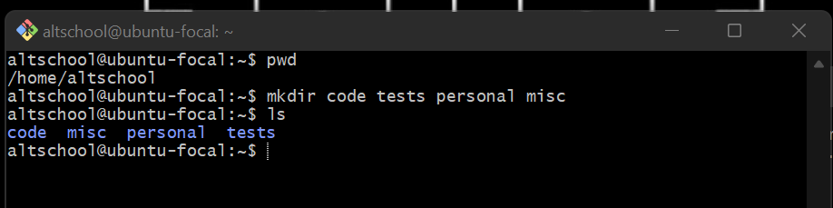

1. Changing directory to the tests using absolute pathname with ```cd /home/altschool/tests```

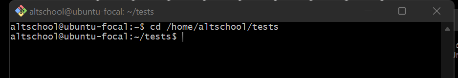

2. Changing directory to the tests using relative pathname with ``` cd ./tests```

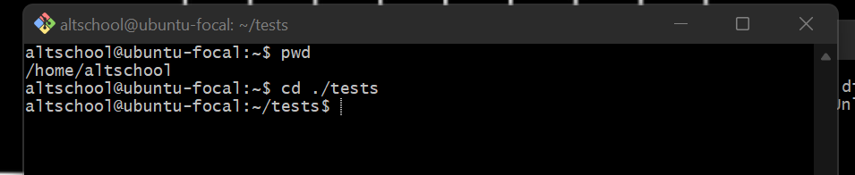

3. Using echo command to creae a fileA with ```echo 'Hello A' > /home/altschool/misc/fileA```

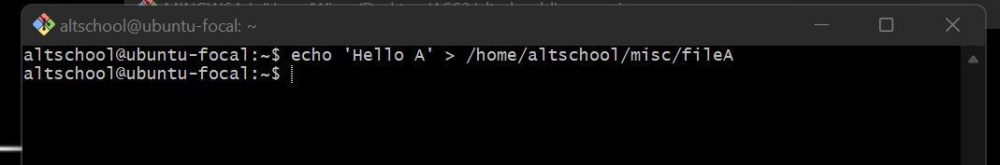

4. Creating empty fileB with ```touch /home/altschool/misc/fileB``` and using `echo` for dummy content

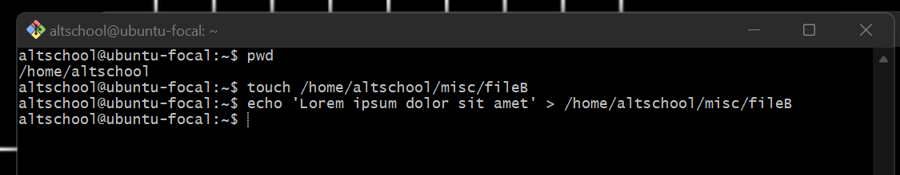

5. Copying fileA contents to fileC contents with ```cp /home/altschool/misc/fileA /home/altschool/misc/filec```

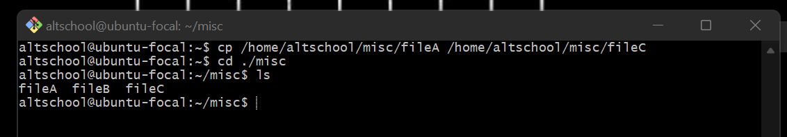

6. Moving fileB content with ```mv /home/altschool/misc/fileB /home/altschool/misc/fileD```

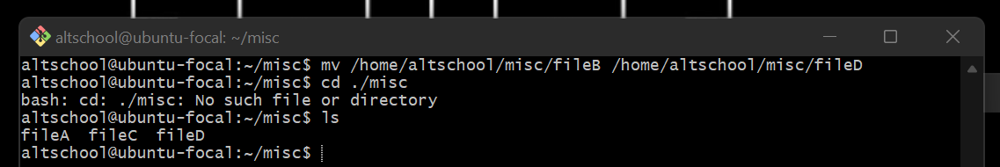

7. Creating misc.tar archive with ```tar -cvf misc.tar misc```

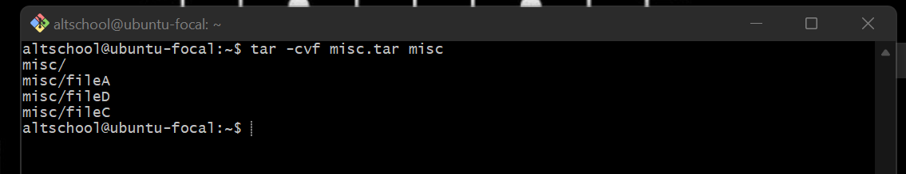

8. Compressing misc.tar archive created with ```gzip misc.tar```


9. Creating a user and forcing the user to change his password upon login
> We first have to make our altschool user a sudoer then proceed to create the user and the password expiry command.


> Adding the user val using the `adduser`

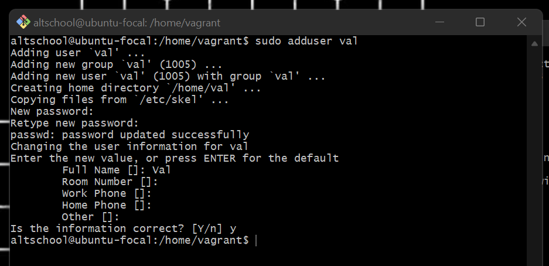

> Passwd expiry upon login command for val user with ```sudo passwd --expire val```

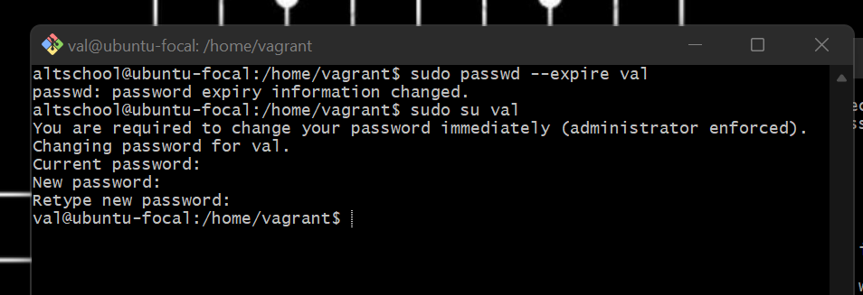

